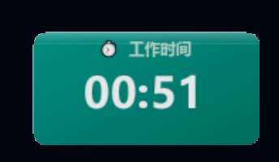
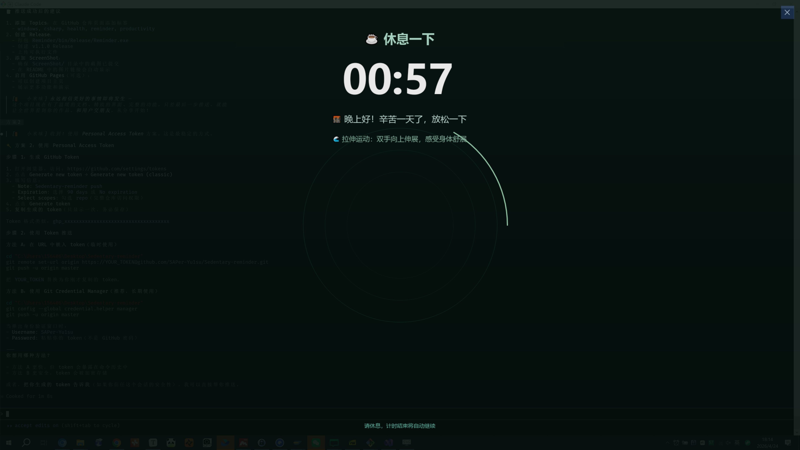

# 久坐提醒工具 ⏱️

<div align="center">


**一款温暖的 Windows 桌面应用，用科学的工作/休息循环守护你的健康**

[English](./README_EN.md) | 简体中文

</div>

---

## ✨ 为什么需要它？

> 💻 长时间久坐 = 慢性自杀  
> 🏥 颈椎病、腰椎病、眼疲劳...这些职业病正在悄悄靠近  
> ⏰ 但我们总是"忘记"休息，直到身体发出警告

**久坐提醒工具**用温柔而坚定的方式，帮你养成健康的工作习惯。

---

## 🎯 核心功能

### 🔄 智能工作/休息循环
- 自定义工作时长（1-120 分钟）
- 自定义休息时长（1-30 分钟）
- 自动循环，无需手动干预
- 开机自启动（可选）

### 🎨 精致的视觉体验
- **主窗口**：现代化卡片设计，启动淡入动画
- **工作计时器**：圆角浮动窗口，呼吸式颜色动画
- **休息界面**：全屏护眼深绿色，呼吸圆环动画
- **15 秒预警**：倒计时最后 15 秒窗口变色提醒

### 💬 温暖的文案设计
- **16 条鼓励语**：每次休息都有不同的温暖问候
- **16 条运动建议**：从严肃到轻松，总有一款适合你
- **时间段问候**：早晨、午休、晚上...不同时段不同关怀

### 🔒 强制休息模式（可选）
- 休息时锁定键盘和鼠标
- 强制你离开电脑，真正休息
- 需要管理员权限

### 🎈 其他贴心功能
- 系统托盘最小化
- 单实例运行防止重复启动
- 倒计时数字跳动动画
- 按钮呼吸效果

---

## 📸 界面预览

### 主要界面

<table>
  <tr>
    <td align="center"><b>主配置界面</b></td>
    <td align="center"><b>工作计时器</b></td>
  </tr>
  <tr>
    <td></td>
    <td></td>
  </tr>
  <tr>
    <td align="center"><b>休息全屏界面</b></td>
    <td align="center"><b>演示动画</b></td>
  </tr>
  <tr>
    <td></td>
    <td></td>
  </tr>
</table>

### 久坐危害


---

## 🚀 快速开始

### 系统要求

| 项目 | 要求 |
|------|------|
| 操作系统 | Windows 7 / 10 / 11 |
| .NET Framework | 4.8 |
| 管理员权限 | 仅在使用输入锁定功能时需要 |

### 下载安装

1. 从 [Releases](https://github.com/SAPer-Yu1su/Sedentary-reminder/releases) 下载最新版本
2. 解压到任意目录
3. 双击 `Reminder.exe` 启动

**如需使用输入锁定功能**：
- 右键 `Reminder.exe` → **以管理员身份运行**
- 或右键 → **属性** → **兼容性** → 勾选 **以管理员身份运行此程序**

---

## 📖 使用指南

### 1️⃣ 配置工作/休息时间


- 设置**工作时长**（推荐 25-45 分钟）
- 设置**休息时长**（推荐 5-10 分钟）
- 可选：勾选**休息时锁定键盘和鼠标**
- 可选：勾选**开机自动启动**
- 点击**开始工作**

### 2️⃣ 工作阶段


- 浮动窗口显示在屏幕右下角
- 可拖动到任意位置
- 呼吸式颜色动画
- 倒计时最后 15 秒：
  - 窗口变为橙红色
  - 显示 "⚠️ 该休息了！"

### 3️⃣ 休息阶段


- 全屏护眼深绿色背景
- 随机显示鼓励语和运动建议
- 根据时间段显示不同问候
- 呼吸圆环动画
- 倒计时数字跳动效果
- 如果启用了锁定：键盘鼠标完全不可用
- 如果未启用锁定：按 `ESC` 或 `Alt+F4` 可退出

### 4️⃣ 系统托盘

- 关闭主窗口后自动最小化到托盘
- 右键托盘图标：
  - **首选项** — 打开主配置界面
  - **关于** — 查看版本信息
  - **退出** — 完全关闭程序

---

## 🎨 设计理念

### 视觉设计
- **主窗口**：现代卡片式设计，渐变背景，圆角阴影
- **工作计时器**：翡翠绿渐变，圆角窗口，呼吸动画
- **休息界面**：护眼深绿色，呼吸圆环，粒子效果

### 交互设计
- **启动淡入**：窗口从透明到不透明，优雅出现
- **按钮呼吸**：主按钮持续呼吸效果，吸引点击
- **数字跳动**：倒计时变化时数字放大缩小
- **时间感知**：根据时间段显示不同问候语

### 文案设计
- **温暖鼓励**："🌻 阳光正好，微风不燥，适合发呆"
- **轻松建议**："🎵 跟着节奏：放首喜欢的歌，随意摇摆"
- **时段问候**："🌅 早安！新的一天，从健康开始"

---

## 🛠️ 技术架构

### 项目结构

```
Sedentary-reminder/
├── Reminder/
│   ├── MainFrm.cs              # 主配置窗口
│   ├── WorkFrm.cs              # 工作计时器
│   ├── RestFrm.cs              # 休息全屏界面
│   ├── KeyboardBlocker.cs      # 输入锁定
│   ├── AnimationController.cs  # 动画控制器
│   ├── SessionManager.cs       # 会话管理
│   ├── ConfigManager.cs        # 配置管理
│   ├── TrayManager.cs          # 托盘管理
│   └── asset/                  # 图标资源
├── README.md                   # 中文文档
├── README_EN.md                # 英文文档
└── .gitignore                  # Git 忽略规则
```

### 技术栈

- **语言**：C# (.NET Framework 4.8)
- **UI 框架**：Windows Forms
- **图形**：GDI+ (System.Drawing)
- **动画**：Timer + 自定义动画控制器
- **输入锁定**：Win32 API `BlockInput`

### 核心流程

```
Program.cs (单实例检查)
    ↓
MainFrm (配置界面)
    ↓ 点击"开始工作"
SessionManager.StartWorkSession()
    ↓
WorkFrm (工作计时)
    ↓ 倒计时结束
SessionManager.TransitionToRest()
    ↓
RestFrm (休息界面)
    ↓ 倒计时结束
SessionManager.TransitionToWork()
    ↓ 循环
WorkFrm ...
```

---

## ❓ 常见问题

<details>
<summary><b>Q: 锁定键盘鼠标不起作用？</b></summary>

A: 请确保**以管理员身份运行**程序。普通权限下 `BlockInput` API 会静默失败。
</details>

<details>
<summary><b>Q: 如何在锁定状态下紧急退出？</b></summary>

A: 同时按下 `Ctrl+Alt+Del`，然后选择关机、注销或切换用户。这个组合键无法被屏蔽。
</details>

<details>
<summary><b>Q: 程序会保存我的设置吗？</b></summary>

A: 会的！工作时长、休息时长、输入锁定选项会自动保存到 `config.json`。开机自启动设置保存在注册表中。
</details>

<details>
<summary><b>Q: 可以暂停倒计时吗？</b></summary>

A: 当前版本不支持暂停功能。设计理念是"强制休息"，避免用户拖延。
</details>

<details>
<summary><b>Q: 为什么休息界面是深绿色？</b></summary>

A: 深绿色是护眼色，低亮度，适合长时间观看。这是健康功能，不是美学选择。
</details>

---

## 🔨 从源码构建

### 前置要求
- Visual Studio 2019 或更高版本
- .NET Framework 4.8 SDK

### 构建步骤

```bash
# 克隆仓库
git clone https://github.com/SAPer-Yu1su/Sedentary-reminder.git
cd Sedentary-reminder

# 使用 Visual Studio 打开
start Reminder.sln

# 或使用 MSBuild 命令行
msbuild Reminder.sln /p:Configuration=Release /t:Rebuild
```

编译产物位于 `Reminder/bin/Release/Reminder.exe`

---

## 🤝 贡献指南

欢迎贡献代码、报告 Bug、提出建议！

### 如何贡献

1. Fork 本仓库
2. 创建特性分支 (`git checkout -b feature/AmazingFeature`)
3. 提交更改 (`git commit -m 'Add some AmazingFeature'`)
4. 推送到分支 (`git push origin feature/AmazingFeature`)
5. 提交 Pull Request

### 贡献方向

- 🎨 **UI/UX 改进**：更美观的界面、更流畅的动画
- 🌍 **多语言支持**：日语、韩语、法语...
- 🎵 **音效提示**：休息开始/结束的声音提醒
- 📊 **统计功能**：记录工作时长、休息次数
- 🎮 **休息小游戏**：休息时的互动小游戏
- ⚙️ **更多配置**：主题切换、自定义颜色

---

## 📜 开源协议

本项目采用 [MIT License](LICENSE) 开源协议。

---

## 💖 致谢

本项目基于 [@wjbgis](https://github.com/wjbgis) 的 [Sedentary-reminder](https://github.com/wjbgis/Sedentary-reminder) 进行优化和增强。

感谢原作者的开源贡献，让更多人关注健康工作方式。

---

## 📮 联系方式

- **GitHub Issues**: [提交问题](https://github.com/SAPer-Yu1su/Sedentary-reminder/issues)
- **GitHub Discussions**: [参与讨论](https://github.com/SAPer-Yu1su/Sedentary-reminder/discussions)

---

<div align="center">

**⭐ 如果这个项目对你有帮助，请给个 Star 支持一下！**

Made with ❤️ for your health

</div>
